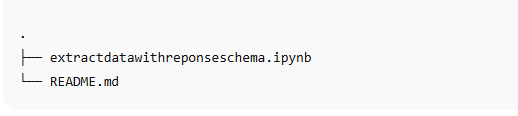

🧠 LLM Structured Extractor (Response Schema)

This project shows how to use an LLM with a response schema to reliably extract structured fields from free-form text.
The notebook extractdatawithreponseschema.ipynb demonstrates prompting the model with a JSON Schema (or equivalent typed schema) so the output is well-formed JSON that maps directly to your target fields.

--------------------------------------------------------------------------------------------------

✨ What it does

Takes unstructured input text (e.g., product/order messages).

Uses a response schema to coerce the model into structured output.

Returns strict JSON with these fields:

gift (string)

delivery_days (integer)

price_value (number)

Works with OpenAI (Structured Outputs / JSON mode), Azure OpenAI, or LangChain (Pydantic / TypedDict). The notebook includes cells you can toggle for your stack.

--------------------------------------------------------------------------------------------------

📁 Files

--------------------------------------------------------------------------------------------------

🧰 Requirements

Python 3.10+

Jupyter Notebook or JupyterLab

One of:

openai (for OpenAI Responses API / JSON mode), or

langchain + pydantic (for schema validation), or

transformers (if you adapt to local models that support JSON constraints)

Install (pick what you need):

pip install jupyter
pip install openai
pip install langchain pydantic
pip install python-dotenv

--------------------------------------------------------------------------------------------------

🔐 Environment Variables

Create a .env file (if using hosted LLMs):

OPENAI_API_KEY=your_api_key_here

The notebook loads .env automatically if present.

--------------------------------------------------------------------------------------------------

🧩 Response Schema (Example)

JSON Schema used in prompts:

{
  "type": "object",
  "properties": {
    "gift": { "type": "string", "description": "Name of the gift item" },
    "delivery_days": { "type": "integer", "minimum": 0, "description": "Estimated delivery time in days" },
    "price_value": { "type": "number", "minimum": 0, "description": "Monetary value without currency symbol" }
  },
  "required": ["gift", "delivery_days", "price_value"],
  "additionalProperties": false
}

Example input text

Ordered a Teddy Bear for my niece; delivery in 3 days and it cost $25 including tax.

Expected model output

{
  "gift": "Teddy Bear",
  "delivery_days": 3,
  "price_value": 25
}

--------------------------------------------------------------------------------------------------

🚀 Running the Notebook

Clone your repo and enter the folder:

git clone https://github.com/<your-username>/<your-repo>.git
cd <your-repo>

(Optional) Create and activate a virtual env.

Install dependencies (see above).

Launch Jupyter:

jupyter notebook extractdatawithreponseschema.ipynb

Open the notebook and run cells top-to-bottom.

Select the OpenAI path (Responses API with JSON schema) or the LangChain.

--------------------------------------------------------------------------------------------------

🧪 Test Quickly

Try these sample inputs inside the notebook:

“Send a Lego Star Wars set; will reach in 5 days, price INR 3499.”

“Chocolate hamper scheduled for delivery tomorrow; paid €18.50.”

“I bought a red scarf as a gift; it comes in 2–4 days for $12.”

The schema will coerce/normalize the fields and validate types.

--------------------------------------------------------------------------------------------------

🛡️ Validation & Error Handling

Validation: The notebook validates the model’s JSON against the schema (Pydantic or jsonschema).

Retries: If the LLM returns invalid JSON, the notebook:

Attempts a lightweight repair (strip code fences, fix trailing commas).

Re-prompts with the schema and the model’s previous attempt.

Guardrails: additionalProperties:false prevents unexpected fields.

--------------------------------------------------------------------------------------------------

🔄 Adapting to Your Stack

OpenAI JSON Mode / Structured Outputs: Uses response-format/schema to guarantee JSON.

LangChain: Defines a Pydantic model mirroring the JSON schema; with_structured_output (or similar) ensures typed results.

Local Models: Use constrained decoding / guidance libraries; keep the same schema.

🧷 Notes on Currencies & Units

price_value is numeric only (no symbols).
If you also need currency codes, extend schema like:

"currency": { "type": "string", "enum": ["USD","EUR","INR","GBP"] }

delivery_days expects an integer; phrases like “2–4 days” can be normalized (e.g., take the lower bound) in a post-processing step—sample code included in the notebook.

--------------------------------------------------------------------------------------------------

🧾 License

MIT
